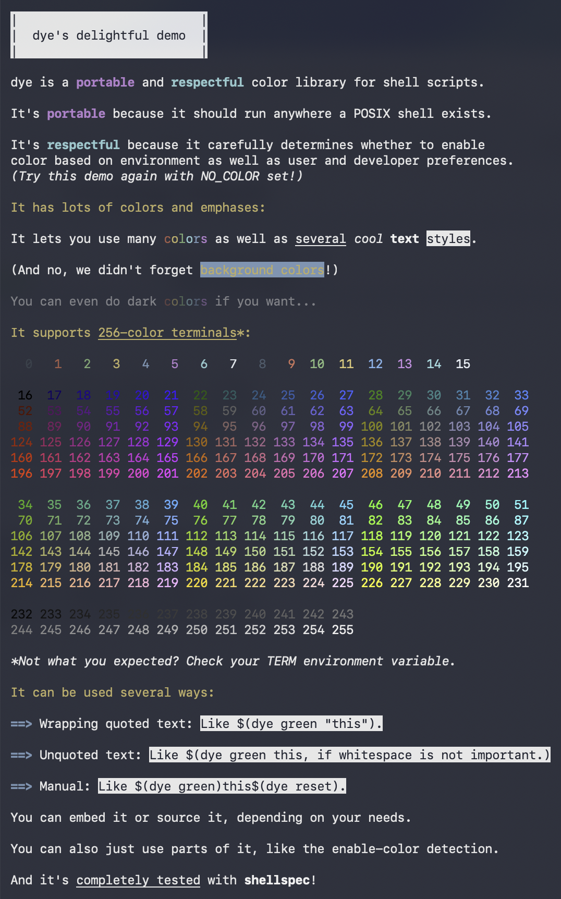

> [!IMPORTANT]
> dye's public source code repository is now hosted on [Codeberg](https://codeberg.org) at [mattiebee/dye](https://codeberg.org/mattiebee/dye). The original public source code repository at [GitHub](https://github.com) is now a best-effort mirror. Releases will only be published at Codeberg.

# [dye](https://mattiebee.dev/dye)

-   [About](#about)
-   [Usage](#usage)
-   [Development](#development)

## Demo



## About

dye is a **portable** and **respectful** library for adding color and emphasis to the output of shell scripts.

It's portable because

-   it works on many Unix systems, including macOS, Linux, and OpenBSD;

-   it is written to [the POSIX shell standard](https://pubs.opengroup.org/onlinepubs/9799919799/utilities/V3_chap02.html#tag_19), so it works in many shells that are POSIX-compatible, such as [ash and Dash](https://en.wikipedia.org/wiki/Almquist_shell), [Bash](https://www.gnu.org/software/bash/), [ksh](https://en.wikipedia.org/wiki/KornShell), [posh](https://packages.debian.org/sid/posh), and [Zsh](https://zsh.sourceforge.io);

-   it uses [tput(1)](https://man.openbsd.org/tput) instead of hard-wired ANSI sequences, so it will work wherever the appropriate [terminal capabilities](https://man.openbsd.org/terminfo.5) are available, and gracefully degrade where they are not; and

-   it additionally degrades gracefully if tput(1) is not available (e.g. in [a Docker alpine image](https://hub.docker.com/_/alpine) where ncurses is not installed).

It's respectful because:

-   it will disable if ["NO_COLOR"](https://no-color.org) is set;

-   it will enable if ["CLICOLOR"](https://bixense.com/clicolors/) is set, but only if stdout is a tty;

-   it will unconditionally enable (e.g. if stdout is not a [tty](https://en.wikipedia.org/wiki/Tty_(Unix))) if "CLICOLOR_FORCE" is set;

-   it allows script developers to choose to default to color off unless the user has opted in with environment variables; and

-   it is written to only put functions and environment variables prefixed with "dye" or "DYE" into the shell's global namespace, and carefully avoids clobbering any existing shell variables during operation.

dye does call [tput](https://pubs.opengroup.org/onlinepubs/9799919799/utilities/tput.html) for every terminal sequence it needs to output, so it's not screamingly fast. However, in practice, it's more than fast enough for the job I need it for: making the output of shell scripts colorful to make them easier to read and scan. If you're working with lots of color (for example, creating [ANSI art](https://en.wikipedia.org/wiki/ANSI_art)), it's probably best to stick to a solution that caches ANSI sequences and forgo the portability.

I wrote dye to replace my previous project, [portable-color](https://mattiebee.dev/portable-color). portable-color was fine, but would load lots of functions into the shell's global namespace. dye has a better API, with more capabilities and conveniences.

## Usage

### Embedding

You can use dye in your script by copying the contents of [dye.sh](./dye.sh) into your script so that the functions are defined before you use them.

This the method I recommend. Shell scripts that I write are generally made to be self-contained, and embedding makes them very easy to download and use.

A couple notes on this strategy:

-   If you don't want dye's over 100 lines of code at the top of your script, wrap your main code in a function, then insert all of dye's code, and finally call your main function at the end.

-   If you end up changing dye's code, consider changing the names of the dye functions and variables that end up in the shell's global namespace, to avoid conflicts with the standard dye code that may be depended on elsewhere—particularly if you're removing functionality you do not use.

-   If you distribute your script with dye's code inline, you must include a copy of [the license](./LICENSE.md) in some way with your script. This specifically so others understand their rights in regard to the use of this software.

### Sourcing

If you have [dye.sh](./dye.sh) available [on your PATH](https://mattiebee.io/44251/a-proposal-for-shell-libraries) (executable bit not necessary), you can load it very simply:

```shell
. dye.sh || exit 1
```

If you include a copy alongside your script, you can also load it from a specific directory:

```shell
. ./dye.sh || exit 1
```

### Initialization

dye must be initialized once before use, or no text changes will happen when you use the color or emphasis routines:

```shell
dye setup
```

"setup" is where dye will check things like whether stdout is a tty, whether environment variables like "NO_COLOR" and "CLICOLOR" are set, and make a decision whether or not to set the variable "DYE_COLORS" to the number of available colors, which the other routines will use.

An alternate mode for "setup" will not enable color by default, but will enable it if the user has "CLICOLOR" set:

```shell
dye setup default-off
```

### Templates

The best way to use dye is with its built-in templates.

Templates embed other dye commands inside a single string.

```shell
dye print "{{green}}It's not easy being... well, you know.{{reset}}"
```

Like ["echo"](https://pubs.opengroup.org/onlinepubs/9799919799/utilities/echo.html), "dye print" ends its output with a newline.
("dye p" is a shorthand for "dye print" and highly recommended.)

Note that _unlike_ "echo" on many systems, control characters are not automatically parsed. Whatever the shell passes to "dye print" is only processed according to [two simple syntax rules](#syntax).

```shell
dye write "So {{bold}}bold{{reset}}, it's not recommended "
dye write "for human consumption!"
```

"dye write" is the same, except it does not end its output with a newline.

#### Syntax

Templates have two basic syntax rules:

1.  Text between double curly braces ("{{" and "}}") is interpreted as a dye command. The curly braces are not printed.

2.  A backslash ("\") escapes the next character if it is either a backlash or left curly brace. The backslash itself is not printed. Useful if you want to print two left curly braces.

#### Multiline strings

dye commands between double curly braces, and as such can have trailing spaces added to enable multiline strings:

```shell
dye print "We have an {{bold
}}awful{{reset}} lot to say across {{bold
}}many{{reset}} lines."
```

#### Escaping backslashes

There is one caveat to the syntax rules. If you're using double quotes, the backslash behavior can be a bit unintuitive in one case.

```shell
dye print "a\\{{red}}/b"
```

This actually prints "a{{red}}/b", because the double backlash is interpreted as a single backslash by the shell before dye even sees it. dye then interprets the resulting "\\{" as escaping "{".

Escaping both backslashes passes through "\\\\" to dye's engine, which in turn interprets it as an escaped single-backslash. This prints `a\/b` with a red color change in the middle:

```shell
dye print "a\\\\{{red}}/b"
```

Using single-quoted strings works around this issue, but of course sacrifices the variable interpolation you get with double-quoted strings. 

### Wrapping text

> [!NOTE]
> Wrapping text is deprecated due to the awkwardness of dealing with [resets](#resets) and the extra weirdness of [unquoted wrapping](#unquoted-wrapping), and is likely to be removed in a future major version.

For simple [color](#colors) and [emphasis](#emphases), using dye to wrap quoted text is the most convenient method.

```shell
echo "$(dye green "It's not easy being... well, you know.")"
```

```shell
echo "So $(dye bold "bold"), it's not recommended for human consumption\!"
```

#### Unquoted wrapping

Quoting text is also not *strictly* necessary, but can result in the need to use many more escapes (just like it would if using "echo" straight up). It also means whitespace gets collapsed, so beware!

```shell
echo Quotes\? Quotes\? $(dye italic We don\'t need no stinking quotes\!)
```

#### Resets

When wrapping text, one key caveat applies: all colors and several emphases do not have a matching ending terminal sequence—they can only be turned off by sending an "sgr0" terminal capability to reset *all* color and emphasis.

dye will send this reset sequence at the end of wrapped text for colors and select emphases, so it's best not to stack wrappers. It gets unreadable really fast, anyway, so it's better to use [manual control](#manual-control).

### Manual control

You can generally use [command substitution](https://pubs.opengroup.org/onlinepubs/9799919799/utilities/V3_chap02.html#tag_19_06_03) to capture the output from manual control commands so it can all be strung together:

```shell
echo "$(dye cyan)$(dye bold)Cyan$(dye reset), $(dye magenta)$(dye bold
    )magenta$(dye reset), and $(dye bold)white$(dye reset
    ) ought to be enough for anybody."
```

Using lots of manual control can make lines pretty long, but as you can see, you can also leverage the fact that line breaks are valid inside command substitution to break them up.

It's better (and shorter!) to use [templates](#templates), though. Capturing the output of dye works in most cases, but could break in some obscure situations.

### Colors

Many colors are available for use, subject to terminal support.

There's the basic ANSI color set:

-   `black` (or `0`)
-   `red` (or `1`)
-   `green` (or `2`)
-   `yellow` (or `3`)
-   `blue` (or `4`)
-   `magenta` (or `5`)
-   `cyan` (or `6`)
-   `white` (or `7`, or `brightgray`)
-   `gray` (or `8`)
-   `brightred` (or `9`)
-   `brightgreen` (or `10`)
-   `brightyellow` (or `11`)
-   `brightblue` (or `12`)
-   `brightmagenta` (or `13`)
-   `brightcyan` (or `14`)
-   `brightwhite` (or `15`)

"dye yellow" will set the foreground color to yellow, for example. There are also "fg" and "bg" commands that will explicitly set the foreground or background color, respectively:

```shell
dye print '{{bg blue}}{{fg yellow}}In Ann Arbor, everything is this color.{{reset}}'
```

Turning colors off requires replacing them with a different color, or a [reset](#resets).

#### High colors

Some terminal definitions, like "ansi" and "xterm", don't recognize colors higher than 7. If only colors 0-7 are supported, indicated by "DYE_COLORS" being set to 8 (via [setup](#initialization)), dye will synthesize "bright" colors by turning on "bold" and setting the non-bright equivalent color. (Some terminals will, in turn, render this with a bright color!)

Note that this also means that "bold" may be turned on unexpectedly if you're using "bright" colors—so keep this situation in mind:

-   If you're using templates or manual control, be sure to reset at the appropriate time if the possiblity that "bold" might be on.

-   If you're nesting wrapped text, make sure that nested text deals with the fact that "bold" might be on if you're using a "bright" color.

You can test your code in this situation by setting "TERM" to "ansi" or "xterm" on many systems.

### Emphases

Several emphases are available as well.

#### Resettable emphases

The first group, like colors, must be [reset](#resets) to turn them off:

-   `dim` (makes things darker)
-   `bold`
-   `reverse` (see also "standout" below)

They can be used just like colors, and wrapping text with them will automatically send a reset at the end.

#### Endable emphases

The second group have "end" terminal sequences that can turn them off explicitly, with all other settings remaining in play:

-   `italic` (or `i`)
-   `standout` (or `so`, often displayed as reversed foreground and background)
-   `underline` (or `ul`, or `u`)

When using one of these, you don't have to re-enable other modes—just "end" them:

```shell
dye print "{{magenta}}Mary {{italic}}had{{end italic}} a little lamb.{{reset}}"
dye print "{{magenta}}Mary had a {{italic}}little{{end italic}} lamb.{{reset}}"
```

They also support old-school wrapping:

```shell
echo "Visit $(dye ul "https://mattiebee.dev/dye") to get the code."
```

To match "end", "begin" is also available (and works with all emphases). It behaves the same way as just using the emphasis, e.g. "dye begin italic" is equivalent to "dye italic".

## Development

### Testing

Unit tests are exhaustively written in [shellspec](https://shellspec.info). The [specs](./tools/specs) script will look for shells on your system that are expected to be compatible, and run the suite for each, stopping on the first failures.

[coverage](./tools/coverage) pairs shellspec with [kcov](http://simonkagstrom.github.io/kcov/) in [Docker](https://www.docker.com) to gather coverage while running against [Bash](https://www.gnu.org/software/bash/). (I'm using Docker here because I can't get shellspec with kcov to work on macOS.) 100% is impossible to reach due to kcov thinking some syntax isn't covered. But all meaningful lines of [dye.sh](./dye.sh) are covered.

### Standards

Code should all be written to [the POSIX shell spec](https://pubs.opengroup.org/onlinepubs/9799919799/utilities/V3_chap02.html). Deviations are probably bugs. 🐜

This is particularly important because dye should run everywhere it can, including in very limited systems. If it starts getting loaded up with [Bashisms](https://www.bowmanjd.com/bash-not-bash-posix/), it won't work in some places.

### Notes

#### tput

During the development of dye, I did explore things like caching the output of "tput" so it didn't have to be invoked quite so much.

The added complexity was really not worth it, since "tput" is still fast enough (i.e. not at all noticeably slow) for most purposes where a shell script is doing work for at least a small amount of time. The cache would also need to be filled, and most scripts just don't switch colors enough to make it worthwhile.

The sequences dye generally uses are simple and unconcerned with this, but there are also interesting details with certain terminal control sequences on certain systems that "tput" can handle if invoked directly, such as embedded delays. So, the practice also encourages maximum compatibility—especially if using the new template engine, which passes control back and forth between "tput" and "printf".
